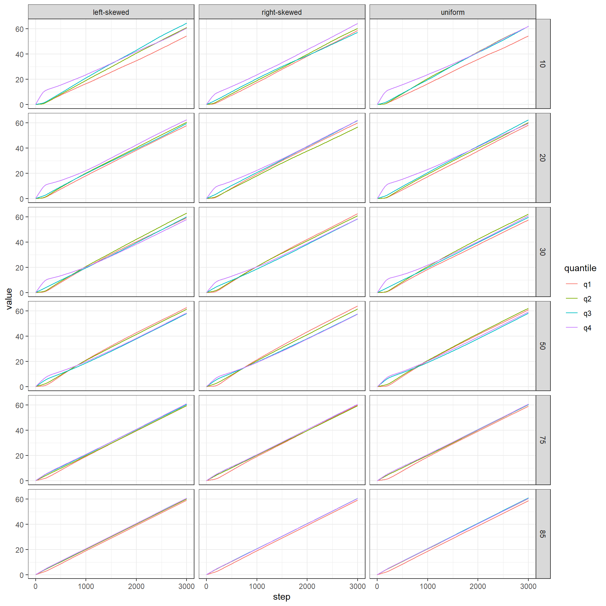

::: {.cell}

:::


# Effect of grant size


::: {.cell}

```{.r .cell-code}
no_network <- df %>% 
  filter(network == "none")
  
no_network_unif_dist <- no_network %>% 
  filter(init_dist == "uniform")


pdata <- no_network_unif_dist %>% 
  group_by(step, funded_share) %>% 
  summarise(mean_gini = mean(resources_gini),
            mean_cumulative_gini = mean(total_funding_gini),
            mean_sharing = mean(perc_sharing)) %>% 
  collect()

p1 <- pdata %>%  
  ggplot(aes(step, mean_gini, colour = as.factor(funded_share))) +
  geom_line() +
    labs(colour = "% of groups receiving funding",
       y = "Gini of current resources")

p2 <- pdata %>%  
  ggplot(aes(step, mean_cumulative_gini, colour = as.factor(funded_share))) +
  geom_line() +
    labs(colour = "% of groups receiving funding",
       y = "Gini of total resources")

p3 <- pdata %>%  
  ggplot(aes(step, mean_sharing, colour = as.factor(funded_share))) +
  geom_line() +
  labs(colour = "% of groups receiving funding",
       y = "% of groups sharing data") 

p1 / p2 / p3 +
  plot_layout(guides = "collect") +
  plot_annotation(tag_levels = "A") & theme(legend.position = "top")
```

::: {.cell-output .cell-output-stderr}
```
Warning: Removed 6 rows containing missing values (`geom_line()`).
```
:::

::: {.cell-output-display}
{#fig-vary-share-of-funded-teams width=864}
:::
:::


Both Gini indexes (Panels A and B of @fig-vary-share-of-funded-teams) are very
stable after an initial adaptation, and reflect the general level of selectivity
of research funding: low selectivity leads to low inequality of resources and
vice versa.

The percentage of teams sharing data is also affected by the selectivity of
funding: more selective funding leads to lower sharing. This is assuming no
incentives at all and solely represents the agents' internal dynamics of
assessing whether they are better or worse off in this round than the previous
one.

> Is this an expected finding?


## Comparing network effects


::: {.cell}

```{.r .cell-code}
uniform <- df %>% 
  filter(init_dist == "uniform")

pdata <- uniform %>% 
  select(run_number, network, funded_share, step, perc_sharing, resources_gini,
         total_funding_gini) %>% 
  group_by(network, funded_share, step) %>% 
  summarise(mean_gini = mean(resources_gini),
            mean_cumulative_gini = mean(total_funding_gini),
            mean_sharing = mean(perc_sharing)) %>% 
  collect() %>% 
  pivot_longer(c(mean_gini, mean_sharing, mean_cumulative_gini))

p_gini <- pdata %>% 
  filter(name == "mean_cumulative_gini") %>% 
  ggplot(aes(step, value, colour = network)) +
  geom_line() +
  facet_wrap(vars(funded_share), ncol = 1) +
  labs(y = "Mean Gini of total resources")

p_sharing <- pdata %>% 
  filter(name == "mean_sharing") %>% 
  ggplot(aes(step, value, colour = network)) +
  geom_line() +
  facet_wrap(vars(funded_share), ncol = 1) +
  labs(y = "Mean % of teams sharing data")

p_sharing + p_gini +
  plot_layout(guides = "collect") +
  plot_annotation(tag_levels = "A") &
  theme(legend.position = "top")
```

::: {.cell-output .cell-output-stderr}
```
Warning: Removed 3 rows containing missing values (`geom_line()`).
```
:::

::: {.cell-output-display}
{#fig-network-effect width=960}
:::
:::


The red lines in @fig-network-effect correspond to @fig-vary-share-of-funded-teams.
It is clear that with network effects and without any incentives, data sharing
does not occur. The Gini of total resources is therefore stable across different
rates of funder selectivity. It slightly declines for the case of no networks, 
given that data sharing seems to perturb the otherwise stable trajectory of 
funding allocation.

## Effect on success of different groups


::: {.cell}

```{.r .cell-code}
group_success <- no_network %>% 
  group_by(step, funded_share, init_dist) %>% 
  summarise(across(contains("mean_funds"), .fns = mean)) %>% 
  collect()
```
:::

::: {.cell}

```{.r .cell-code}
pdata <- group_success %>% 
  pivot_longer(contains("mean_funds"), names_to = "quantile",
               names_pattern = ".*_(q\\d)")

pdata %>% 
  ggplot(aes(step, value, colour = quantile)) +
  geom_line() +
  facet_grid(rows = vars(funded_share),
             cols = vars(init_dist)) +
  guides(colour = guide_legend(reverse = TRUE)) +
  labs(y = "Total funding acquired", colour = "Initial resource quantile") +
  theme(legend.position = "top")
```

::: {.cell-output-display}
{#fig-resources-by-quantile width=768}
:::
:::

With the current settings on randomness in the proposal generation
(proposal-sigma = 0.15), the distribution of resources exhibits dynamics of 
cumulative advantage under selective funding regimes. With only 10% of teams
being receiving funding each round, teams that initially had more funding than
others (fourth quantile, "q4") acquire substantially more funding over the
course of the simulation. This effect is much weaker for less selective funding
regimes.

The effect of the initial resource distribution is small, and as expected. 
However, the terminology (coming from the peer review model) is wrong: what is
termed a "left-skewed" distribution should be a distribution that has few low
values and many high values (more high values than low values). This was the 
wrong way until now and will be changed in later iterations of the simulation.

In substantive terms: where the initial resource distribution had few actors
with high resources (wrongly termed "left-skewed" here) leads to a more unequal
distribution later on.


Below we provide the same for a random
network (@fig-resources-by-quantile-random-network), and for a small-world
network (@fig-resources-by-quantile-small-world-network). Without having 
compared them precisely, results look identical. (To establish this more 
formally, one could restructure the plots and directly compare the network vs.
non-network part).


::: {.cell}

```{.r .cell-code}
group_success <- df %>% 
  filter(network == "random") %>% 
  group_by(step, funded_share, init_dist) %>% 
  summarise(across(contains("mean_funds"), .fns = mean)) %>% 
  collect()

pdata <- group_success %>% 
  pivot_longer(contains("mean_funds"), names_to = "quantile",
               names_pattern = ".*_(q\\d)")

pdata %>% 
  ggplot(aes(step, value, colour = quantile)) +
  geom_line() +
  facet_grid(rows = vars(funded_share),
             cols = vars(init_dist)) +
  guides(colour = guide_legend(reverse = TRUE)) +
  labs(y = "Total funding acquired", colour = "Initial resource quantile") +
  theme(legend.position = "top")
```

::: {.cell-output-display}
{#fig-resources-by-quantile-random-network width=768}
:::
:::

::: {.cell}

```{.r .cell-code}
group_success <- df %>% 
  filter(network == "small-world") %>% 
  group_by(step, funded_share, init_dist) %>% 
  summarise(across(contains("mean_funds"), .fns = mean)) %>% 
  collect()

pdata <- group_success %>% 
  pivot_longer(contains("mean_funds"), names_to = "quantile",
               names_pattern = ".*_(q\\d)")

pdata %>% 
  ggplot(aes(step, value, colour = quantile)) +
  geom_line() +
  facet_grid(rows = vars(funded_share),
             cols = vars(init_dist)) +
  guides(colour = guide_legend(reverse = TRUE)) +
  labs(y = "Total funding acquired", colour = "Initial resource quantile") +
  theme(legend.position = "top")
```

::: {.cell-output-display}
{#fig-resources-by-quantile-small-world-network width=768}
:::
:::
