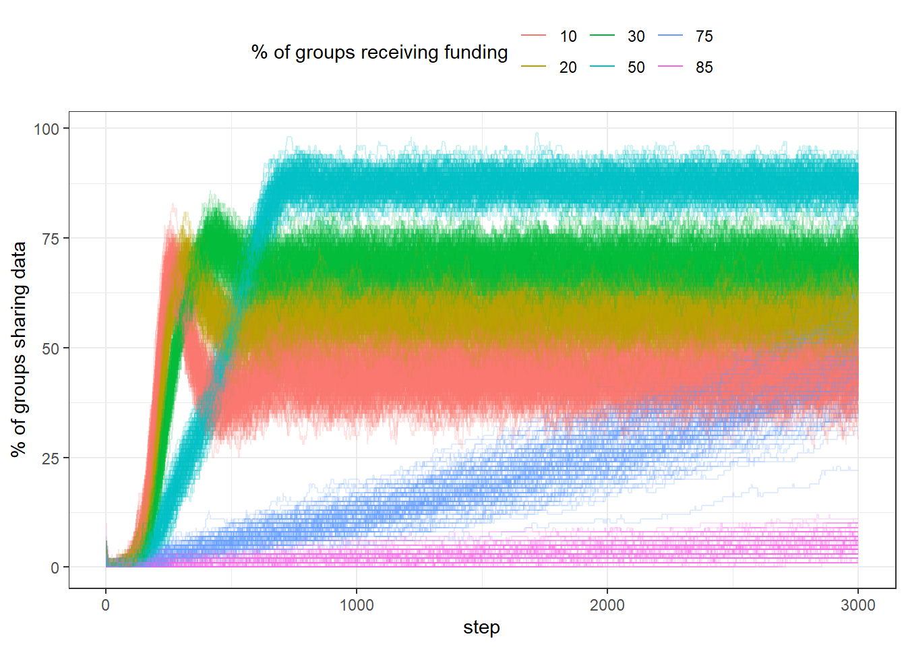

::: {.cell}

:::


## Read data


::: {.cell}

```{.r .cell-code}
df <- tar_read(baseline_selection)
```
:::


## No network & uniform data

::: {.cell}

```{.r .cell-code}
no_network <- df %>% 
  filter(network == "none", init_dist == "uniform")


pdata <- no_network %>% 
  group_by(step, funded_share) %>% 
  summarise(mean_gini = mean(resources_gini),
            mean_sharing = mean(perc_sharing))

p1 <- pdata %>%  
  ggplot(aes(step, mean_gini, colour = as.factor(funded_share))) +
  geom_line() +
    labs(colour = "% of groups receiving funding",
       y = "Gini of resources")

p2 <- pdata %>%  
  ggplot(aes(step, mean_sharing, colour = as.factor(funded_share))) +
  geom_line() +
  labs(colour = "% of groups receiving funding",
       y = "% of groups sharing data") 
```
:::

::: {.cell}

```{.r .cell-code}
p1 / p2 +
  plot_layout(guides = "collect") & theme(legend.position = "top")
```

::: {.cell-output-display}
{#fig-vary-share-of-funded-teams width=864}
:::
:::


The above is very interesting: we are not changing incentives, however sharing 
rate still varies widely. This is a consequence of how exposed agents are to
the funding agency. If only few are funded, not many come into contact. However,
if almost everyone is funded, the policy seems to work only very slowly, because
there is no advantage in sharing or not (because anyways almost everyone is
funded). It is also interesting that sharing initially rises, but then drops 
again (for low values of funded share). 

The gini is in some sense a direct effect of selectivity of funding and thus not
particularly interesting when doing this baseline aspect.


Below we visualise variability in the runs.

::: {.cell}

```{.r .cell-code}
no_network %>% 
  # filter(funded_share == 50) %>% 
  ggplot(aes(step, perc_sharing, group = run_number,
             colour = as.factor(funded_share))) +
  geom_line(alpha = .2) +
  theme(legend.position = "top") +
  labs(colour = "% of groups receiving funding",
       y = "% of groups sharing data") +
  guides(colour = guide_legend(override.aes = list(alpha = 1)))
```

::: {.cell-output-display}
{width=672}
:::
:::
