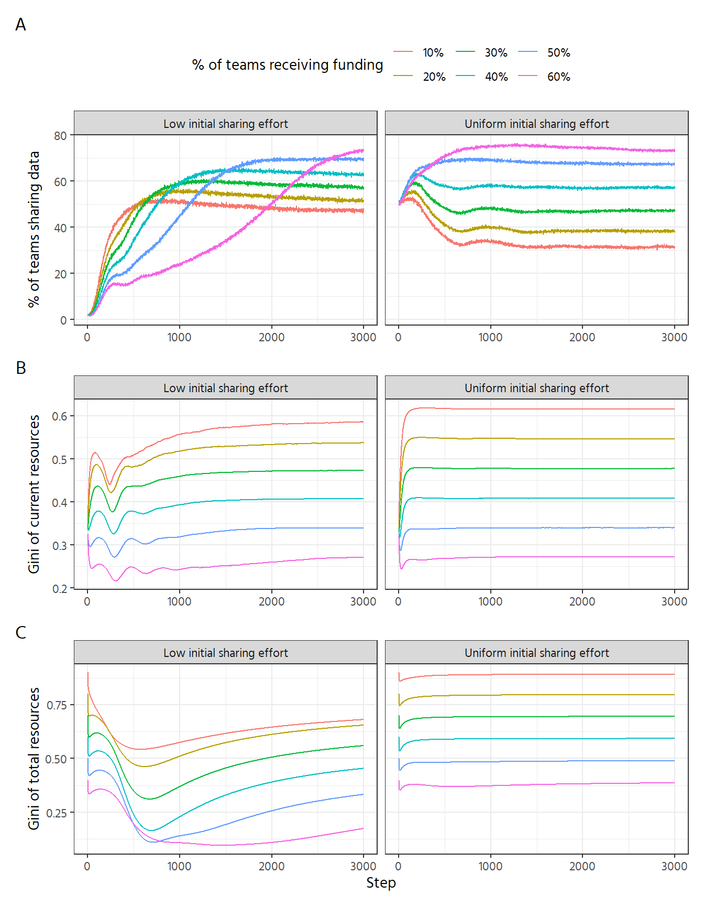

::: {.cell}

:::


# Effect of grant size

::: {.cell}

```{.r .cell-code}
pdata <- df %>% 
  # remove this value. it was mainly kept for compatibility with prior analyses,
  # but results are very similar to the run with setting -4, so no additional
  # value to show it here
  filter(max_initial_utility != -3, step > 0) %>% 
  group_by(step, funded_share, max_initial_utility) %>% 
  summarise(mean_gini = mean(resources_gini),
            mean_cumulative_gini = mean(total_funding_gini),
            mean_sharing = mean(perc_sharing)) %>% 
  collect() %>% 
  mutate(max_initial_utility = recode(max_initial_utility, `4` = "Uniform initial sharing effort",
                                      `-4` = "Low initial sharing effort"),
         funded_share = scales::percent(funded_share, accuracy = 1))

n_row <- 1

p1 <- pdata %>%  
  ggplot(aes(step, mean_gini, colour = as.factor(funded_share))) +
  geom_line() +
    facet_wrap(vars(max_initial_utility), nrow = n_row) +
    labs(colour = "% of teams receiving funding",
       y = "Gini of current resources", x = NULL)

p2 <- pdata %>%  
  ggplot(aes(step, mean_cumulative_gini, colour = as.factor(funded_share))) +
  geom_line() +
    facet_wrap(vars(max_initial_utility), nrow = n_row) +
    labs(colour = "% of teams receiving funding",
       y = "Gini of total resources",
       x = "Step")

p3 <- pdata %>%  
  ggplot(aes(step, mean_sharing, colour = as.factor(funded_share))) +
  geom_line() +
  facet_wrap(vars(max_initial_utility), nrow = n_row) +
  labs(colour = "% of teams receiving funding",
       y = "% of teams sharing data", x = NULL) 

p3 / p1 / p2 +
  plot_layout(guides = "collect") +
  plot_annotation(tag_levels = "A") & theme(legend.position = "top")
```

::: {.cell-output-display}
{#fig-funder-selectivity width=672}
:::
:::
