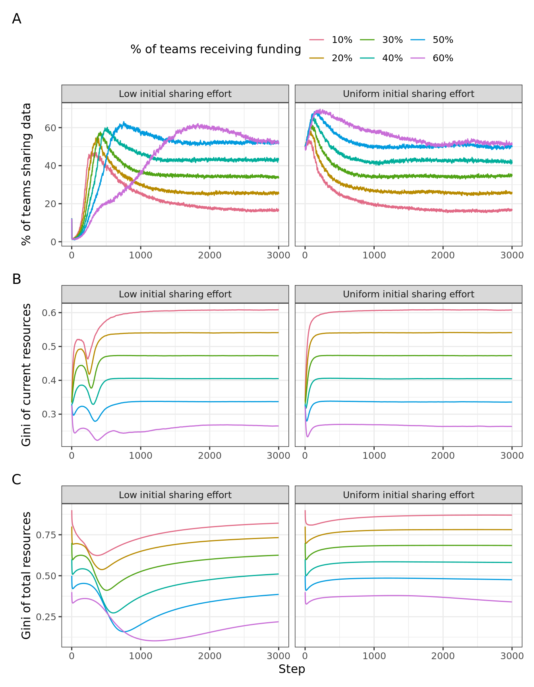

Research questions:
- What is the effect of a funding agency’s level of selectivity on the uptake of data sharing among research teams which allocate their resources strategically?


Approach:

1. Reproduce the below analysis from new simulation file
2. Run across all three types of networks
3. Back up claims by individual data


::: {.cell}

:::

::: {.cell}

```{.r .cell-code}
summarised_data <- df %>% 
  filter(step > 0, sharingincentive == .4) %>% 
  group_by(step, fundedshare, maxinitialutility, network) %>% 
  summarise(mean_gini = mean(gini_resources_of_turtles),
            mean_cumulative_gini = mean(gini_totalfunding_of_turtles),
            mean_sharing = mean(sharing)) %>% 
  collect() %>% 
  mutate(maxinitialutility = recode(maxinitialutility, `4` = "Uniform initial sharing effort",
                                      `-4` = "Low initial sharing effort"),
         fundedshare = scales::percent(fundedshare, accuracy = 1))
```

::: {.cell-output .cell-output-stderr}
```
`summarise()` has grouped output by "step", "fundedshare", and
"maxinitialutility". You can override using the `.groups` argument.
```
:::

::: {.cell-output .cell-output-stderr}
```
Warning: Missing values are always removed in SQL aggregation functions.
Use `na.rm = TRUE` to silence this warning
This warning is displayed once every 8 hours.
```
:::
:::


# No network

::: {.cell}

```{.r .cell-code}
n_row <- 1

no_network <- summarised_data %>% 
  filter(network == "none")

p1 <- no_network %>%  
  ggplot(aes(step, mean_gini, colour = as.factor(fundedshare))) +
  geom_line() +
  facet_wrap(vars(maxinitialutility), nrow = n_row) +
  labs(colour = "% of teams receiving funding",
       y = "Gini of current resources", x = NULL)

p2 <- no_network %>%  
  ggplot(aes(step, mean_cumulative_gini, colour = as.factor(fundedshare))) +
  geom_line() +
    facet_wrap(vars(maxinitialutility), nrow = n_row) +
    labs(colour = "% of teams receiving funding",
       y = "Gini of total resources",
       x = "Step")

p3 <- no_network %>%  
  ggplot(aes(step, mean_sharing, colour = as.factor(fundedshare))) +
  geom_line() +
  facet_wrap(vars(maxinitialutility), nrow = n_row) +
  labs(colour = "% of teams receiving funding",
       y = "% of teams sharing data", x = NULL) 

p3 / p1 / p2 +
  plot_layout(guides = "collect") +
  plot_annotation(tag_levels = "A") & theme(legend.position = "top")
```

::: {.cell-output-display}
{#fig-no-network width=672}
:::
:::


# Random network

::: {.cell}

```{.r .cell-code}
n_row <- 1

pdata <- summarised_data %>% 
  filter(network == "random")

p1 <- pdata %>%  
  ggplot(aes(step, mean_gini, colour = as.factor(fundedshare))) +
  geom_line() +
  facet_wrap(vars(maxinitialutility), nrow = n_row) +
  labs(colour = "% of teams receiving funding",
       y = "Gini of current resources", x = NULL)

p2 <- pdata %>%  
  ggplot(aes(step, mean_cumulative_gini, colour = as.factor(fundedshare))) +
  geom_line() +
    facet_wrap(vars(maxinitialutility), nrow = n_row) +
    labs(colour = "% of teams receiving funding",
       y = "Gini of total resources",
       x = "Step")

p3 <- pdata %>%  
  ggplot(aes(step, mean_sharing, colour = as.factor(fundedshare))) +
  geom_line() +
  facet_wrap(vars(maxinitialutility), nrow = n_row) +
  labs(colour = "% of teams receiving funding",
       y = "% of teams sharing data", x = NULL) 

p3 / p1 / p2 +
  plot_layout(guides = "collect") +
  plot_annotation(tag_levels = "A") & theme(legend.position = "top")
```

::: {.cell-output-display}
{#fig-random-network width=672}
:::
:::


# Clustered network

::: {.cell}

```{.r .cell-code}
n_row <- 1

pdata <- summarised_data %>% 
  filter(network == "clustered")

p1 <- pdata %>%  
  ggplot(aes(step, mean_gini, colour = as.factor(fundedshare))) +
  geom_line() +
  facet_wrap(vars(maxinitialutility), nrow = n_row) +
  labs(colour = "% of teams receiving funding",
       y = "Gini of current resources", x = NULL)

p2 <- pdata %>%  
  ggplot(aes(step, mean_cumulative_gini, colour = as.factor(fundedshare))) +
  geom_line() +
    facet_wrap(vars(maxinitialutility), nrow = n_row) +
    labs(colour = "% of teams receiving funding",
       y = "Gini of total resources",
       x = "Step")

p3 <- pdata %>%  
  ggplot(aes(step, mean_sharing, colour = as.factor(fundedshare))) +
  geom_line() +
  facet_wrap(vars(maxinitialutility), nrow = n_row) +
  labs(colour = "% of teams receiving funding",
       y = "% of teams sharing data", x = NULL) 

p3 / p1 / p2 +
  plot_layout(guides = "collect") +
  plot_annotation(tag_levels = "A") & theme(legend.position = "top")
```

::: {.cell-output-display}
{#fig-clustered-network width=672}
:::
:::


# Fragmented network

::: {.cell}

```{.r .cell-code}
n_row <- 1

pdata <- summarised_data %>% 
  filter(network == "fragmented")

p1 <- pdata %>%  
  ggplot(aes(step, mean_gini, colour = as.factor(fundedshare))) +
  geom_line() +
  facet_wrap(vars(maxinitialutility), nrow = n_row) +
  labs(colour = "% of teams receiving funding",
       y = "Gini of current resources", x = NULL)

p2 <- pdata %>%  
  ggplot(aes(step, mean_cumulative_gini, colour = as.factor(fundedshare))) +
  geom_line() +
    facet_wrap(vars(maxinitialutility), nrow = n_row) +
    labs(colour = "% of teams receiving funding",
       y = "Gini of total resources",
       x = "Step")

p3 <- pdata %>%  
  ggplot(aes(step, mean_sharing, colour = as.factor(fundedshare))) +
  geom_line() +
  facet_wrap(vars(maxinitialutility), nrow = n_row) +
  labs(colour = "% of teams receiving funding",
       y = "% of teams sharing data", x = NULL) 

p3 / p1 / p2 +
  plot_layout(guides = "collect") +
  plot_annotation(tag_levels = "A") & theme(legend.position = "top")
```

::: {.cell-output-display}
{#fig-fragmented width=672}
:::
:::


## Analysis/Interpretation
Introducing network effects does change results. Where in the initial model with
no network, teams would settle at quite high levels of sharing, even for 
scenarios with low rates of funding, levels of sharing are lower for all cases
with networks. The distributions of resources according to the Gini follow the
same patterns, albeit at slightly different levels.

For the case of a random network, equilibria are not very stable. Under highly
competitive funding, the initial stage of the simulation shows large swings in
the rate of teams sharing data - from no-one sharing data to 80% of teams 
sharing data, back to 5% of teams sharing data to 75% of teams sharing data,
and so forth. Eventually, the rates of sharing settle onto unstable equilibria 
that reflect the level of funding selectivity: for the case of 10% of teams
receiving funding, about 10-15% of teams share data, for the case of 20% of
teams receiving funding, about 25% of teams share data, and so on.

The same patterns of large initial swings and eventual equilibria hold true for
the clustered and the fragmented network topology. 


::: {.cell}

```{.r .cell-code}
spark_disconnect(sc)
```
:::
