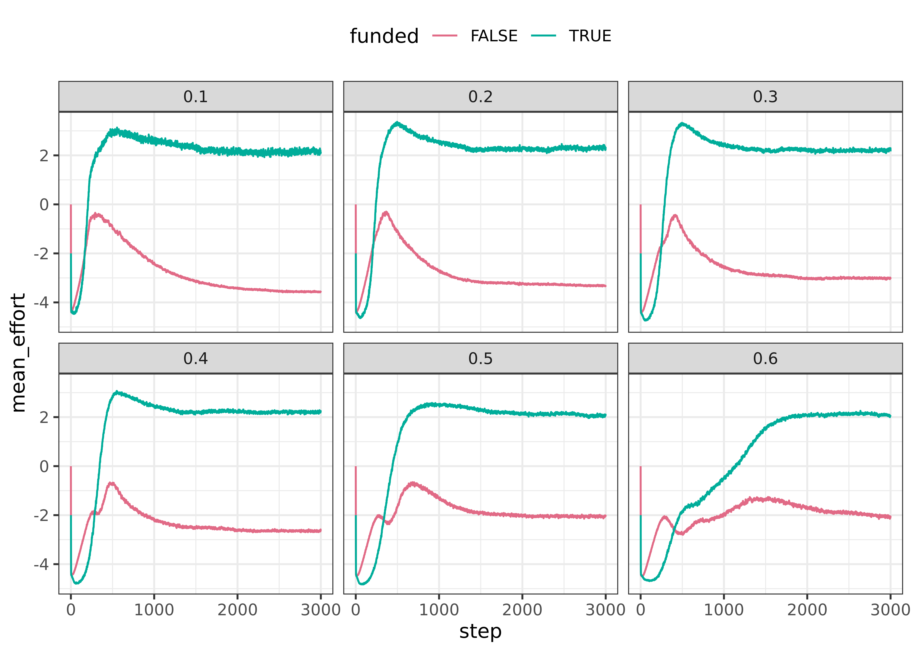
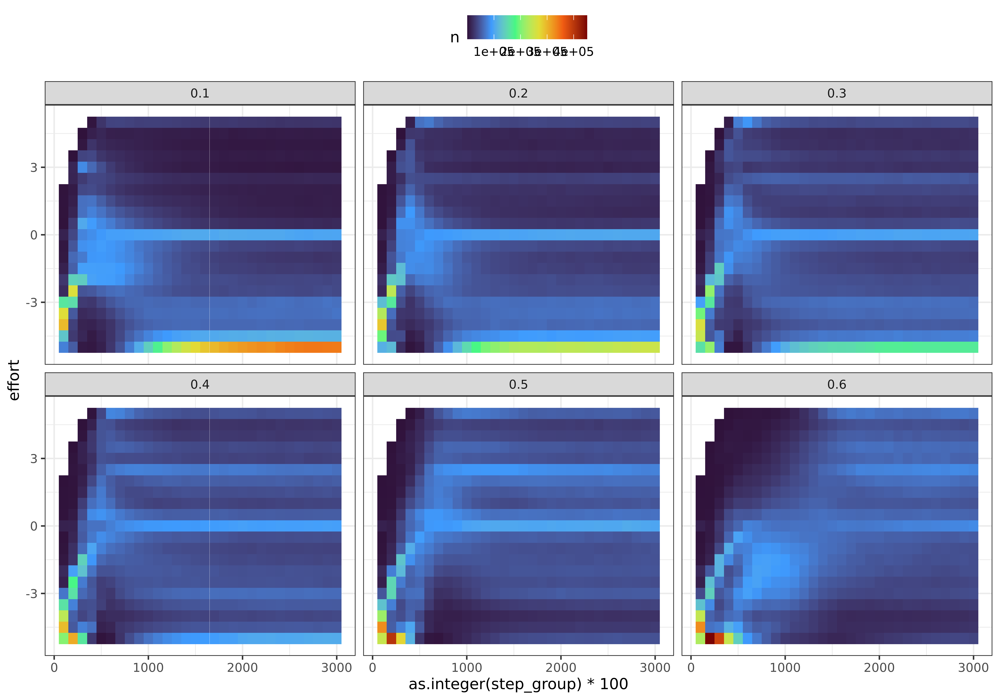
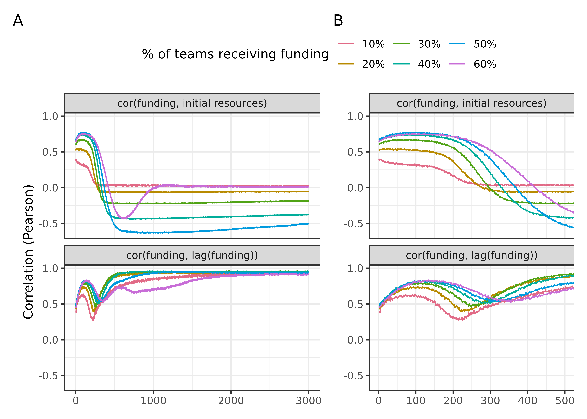
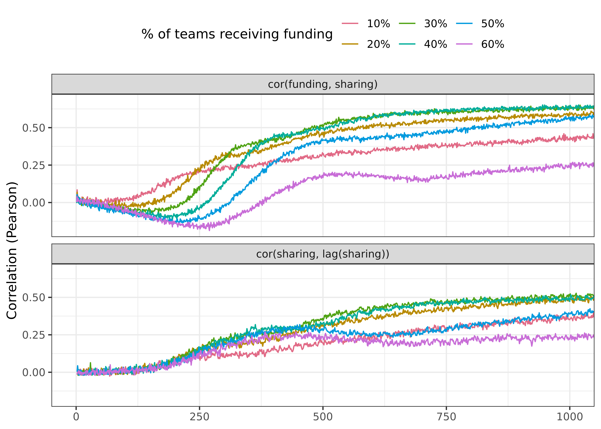

Research questions:

-   Are always the same teams receiving funding?
-   Are those that are being funded also those that share data?
-   Are those that share data / receive funding more or less central in the
    network?


::: {.cell}

:::


# Evolution of effort among funded an non-funded teams


::: {.cell}

```{.r .cell-code}
fragmented_intervention <- fragmented %>% 
  filter(sharingincentive == .4, maxinitialutility == -4)

fragmented_effort <- fragmented_intervention %>% 
  group_by(step, fundedshare, funded) %>% 
  summarise(mean_effort = mean(effort)) %>% 
  collect()
```

::: {.cell-output .cell-output-stderr}
```
`summarise()` has grouped output by "step" and "fundedshare". You can override
using the `.groups` argument.
```
:::

::: {.cell-output .cell-output-stderr}
```
Warning: Missing values are always removed in SQL aggregation functions.
Use `na.rm = TRUE` to silence this warning
This warning is displayed once every 8 hours.
```
:::
:::

::: {.cell}

```{.r .cell-code}
p1 <- fragmented_effort %>% 
  ggplot(aes(step, mean_effort, colour = funded)) +
  geom_line() +
  facet_wrap(vars(fundedshare), nrow = 2) +
  colorspace::scale_colour_discrete_qualitative() +
  theme(legend.position = "top")
p1
```

::: {.cell-output-display}
{width=2100}
:::
:::

::: {.cell}

```{.r .cell-code}
p1 +
  coord_cartesian(xlim = c(0, 1000))
```

::: {.cell-output-display}
{width=2100}
:::
:::


## No network

::: {.cell}

```{.r .cell-code}
no_network_intervention <- no_network %>% 
  filter(sharingincentive == .4, maxinitialutility == -4)

no_network_effort <- no_network_intervention %>% 
  group_by(step, fundedshare, funded) %>% 
  summarise(mean_effort = mean(effort)) %>% 
  collect()
```

::: {.cell-output .cell-output-stderr}
```
`summarise()` has grouped output by "step" and "fundedshare". You can override
using the `.groups` argument.
```
:::
:::

::: {.cell}

```{.r .cell-code}
p1 <- no_network_effort %>% 
  ggplot(aes(step, mean_effort, colour = funded)) +
  geom_line() +
  facet_wrap(vars(fundedshare), nrow = 2) +
  colorspace::scale_colour_discrete_qualitative() +
  theme(legend.position = "top")
p1
```

::: {.cell-output-display}
{width=2100}
:::
:::

::: {.cell}

```{.r .cell-code}
p1 +
  coord_cartesian(xlim = c(0, 1000))
```

::: {.cell-output-display}
{width=2100}
:::
:::


It seems that at first, funded teams keep a low effort, and unfunded teams 
increase their effort. This also explains the slower uptake. It is thus not 
actually the selective pressure (teams adapting towards selective funder), but
rather that the general tendency of increasing effort if unsuccessful or equal
affects a larger portion of the sample when only few are funded.

But hold on: the slope for the funded teams is also steeper for the more 
selective versions. Maybe the selective pressure still does work the way we 
initially described it. Need to check below whether there is this switch in 
which teams receive funding, and whether this changes over the first 500 steps.

# Effort distributions
We want to investigate the distribution of effort over time. Need to bin steps
and effort.


::: {.cell}

```{.r .cell-code}
effort_plot <- function(df, palette = "viridis") {
  df %>% 
    mutate(effort = (as.integer(effort_group) - 20) / 2) %>% 
    ggplot(aes(as.integer(step_group) * 100, effort, fill = n)) +
    geom_tile() +
    scale_fill_viridis_c(option = palette) +
    facet_wrap(vars(fundedshare)) +
    theme(legend.position = "top")
}
```
:::

::: {.cell}

```{.r .cell-code}
effort_breaks <- seq(-10, 10, .5)
step_breaks <- seq(0, 3000, 100)

binned_effort_no_network <- no_network_intervention %>% 
  mutate(effort_group = cut(effort, breaks = effort_breaks, labels = FALSE,
                            include.lowest = TRUE),
         step_group = cut(step, breaks = step_breaks, labels = FALSE,
                          include.lowest = TRUE)) %>% 
  group_by(fundedshare, step_group) %>% 
  count(effort_group) %>% 
  collect()
```
:::

::: {.cell}

```{.r .cell-code}
effort_plot(binned_effort_no_network, "turbo")
```

::: {.cell-output-display}
{width=3000}
:::
:::

::: {.cell}

```{.r .cell-code}
binned_effort_low_clustering <- fragmented_intervention %>% 
  mutate(effort_group = cut(effort, breaks = effort_breaks, labels = FALSE,
                            include.lowest = TRUE),
         step_group = cut(step, breaks = step_breaks, labels = FALSE,
                          include.lowest = TRUE)) %>% 
  group_by(fundedshare, step_group) %>% 
  count(effort_group) %>% 
  collect()
```
:::

::: {.cell}

```{.r .cell-code}
effort_plot(binned_effort_low_clustering, "turbo")
```

::: {.cell-output-display}
{width=3000}
:::
:::


# Are always the same teams receiving funding?
Need to ask a new question here: is there a turnover at the start, at around 
steps 200, in particular for the no network scenario? In the sense, that those
who previously had funding lose it?


::: {.cell}

```{.r .cell-code}
plot_skeleton <- function(df, variant = "one") {
  df %>% 
    pivot_longer(starts_with("mean")) %>% 
    mutate(fundedshare = scales::percent(fundedshare, accuracy = 1),
           name = switch(variant,
                         one = case_match(
                           name,
                           "mean_cor_funding" ~ "cor(funding, lag(funding))",
                           "mean_cor_init_resources" ~ "cor(funding, initial resources)"
                         ),
                         two = case_match(
                           name,
                           "mean_cor_funding_sharing" ~ "cor(funding, sharing)",
                           "mean_cor_sharing_lag" ~ "cor(sharing, lag(sharing))"
                         )
           )) %>% 
    ggplot(aes(step, value, colour = fundedshare)) +
    geom_line() +
    facet_wrap(vars(name), nrow = 2) +
    theme(legend.position = "top") +
    colorspace::scale_colour_discrete_qualitative() +
    labs(colour = "% of teams receiving funding", x = NULL,
         y = "Correlation (Pearson)")
}
```
:::


## Fragmented (low clustering) network

::: {.cell}

```{.r .cell-code}
correlations <- fragmented_intervention %>% 
  group_by(step, fundedshare, run_number) %>% 
  summarise(cor_funding = cor(as.numeric(funded), as.numeric(funded_lag)),
            cor_init_resources = cor(as.numeric(funded), as.numeric(initial_resources))) %>% 
  group_by(step, fundedshare) %>% 
  summarise(mean_cor_funding = mean(cor_funding),
            mean_cor_init_resources = mean(cor_init_resources)) %>% 
  collect()
```

::: {.cell-output .cell-output-stderr}
```
`summarise()` has grouped output by "step" and "fundedshare". You can override
using the `.groups` argument.
`summarise()` has grouped output by "step". You can override using the
`.groups` argument.
`summarise()` has grouped output by "step" and "fundedshare". You can override
using the `.groups` argument.
```
:::
:::

::: {.cell}

```{.r .cell-code}
p <- correlations %>% 
  plot_skeleton()
```
:::

::: {.cell}

```{.r .cell-code}
p2 <- p +
  coord_cartesian(xlim = c(0, 500))
```
:::

::: {.cell}

```{.r .cell-code}
p + 
  p2 + labs(y = NULL) +
  plot_layout(widths = c(5, 4), guides = "collect") +
  plot_annotation(tag_levels = "A") &
  theme(legend.position = "top")
```

::: {.cell-output .cell-output-stderr}
```
Warning: Removed 6 rows containing missing values (`geom_line()`).
Removed 6 rows containing missing values (`geom_line()`).
```
:::

::: {.cell-output-display}
{#fig-funding-cor-over-time-low-clustering width=2100}
:::
:::


This clearly shows: there is some substantial change of events here. Correlation
with initial resources is stable at first, but plummets just before step 200.
This is also when effort for funded teams goes up substantially. Therefore, we
can conclude: teams that do not share data remain successful at first. But once
the others start to share data, they take over, and correlation with initial 
resources goes either to 0 or even to negative values.
The turnover is not complete, of course, otherwise the correlation would be -1.

## No network

::: {.cell}

```{.r .cell-code}
correlations_no_network <- no_network_intervention %>% 
  group_by(step, fundedshare, run_number) %>% 
  summarise(cor_funding = cor(as.numeric(funded), as.numeric(funded_lag)),
            cor_init_resources = cor(as.numeric(funded), as.numeric(initial_resources))) %>% 
  group_by(step, fundedshare) %>% 
  summarise(mean_cor_funding = mean(cor_funding),
            mean_cor_init_resources = mean(cor_init_resources)) %>% 
  collect()
```

::: {.cell-output .cell-output-stderr}
```
`summarise()` has grouped output by "step" and "fundedshare". You can override
using the `.groups` argument.
`summarise()` has grouped output by "step". You can override using the
`.groups` argument.
`summarise()` has grouped output by "step" and "fundedshare". You can override
using the `.groups` argument.
```
:::
:::

::: {.cell}

```{.r .cell-code}
p <- correlations_no_network %>% 
  plot_skeleton()
```
:::

::: {.cell}

```{.r .cell-code}
p2 <- p +
  coord_cartesian(xlim = c(0, 1000))
```
:::

::: {.cell}

```{.r .cell-code}
p + 
  p2 + labs(y = NULL) +
  plot_layout(widths = c(5, 4), guides = "collect") +
  plot_annotation(tag_levels = "A") &
  theme(legend.position = "top")
```

::: {.cell-output .cell-output-stderr}
```
Warning: Removed 6 rows containing missing values (`geom_line()`).
Removed 6 rows containing missing values (`geom_line()`).
```
:::

::: {.cell-output-display}
{#fig-funding-cor-over-time-no-network width=2100}
:::
:::


# Are those that are being funded also those that share data?

## Low clustering


::: {.cell}

```{.r .cell-code}
funding_vs_sharing <- fragmented_intervention %>% 
  group_by(step, fundedshare, run_number) %>% 
  summarise(cor_funding_sharing = cor(as.numeric(funded), as.numeric(shared_data)),
            cor_sharing_lag = cor(as.numeric(shared_data), as.numeric(shared_data_lag))) %>% 
  group_by(step, fundedshare) %>% 
  summarise(mean_cor_funding_sharing = mean(cor_funding_sharing),
            mean_cor_sharing_lag = mean(cor_sharing_lag)) %>% 
  collect()
```

::: {.cell-output .cell-output-stderr}
```
`summarise()` has grouped output by "step" and "fundedshare". You can override
using the `.groups` argument.
`summarise()` has grouped output by "step". You can override using the
`.groups` argument.
`summarise()` has grouped output by "step" and "fundedshare". You can override
using the `.groups` argument.
```
:::
:::

::: {.cell}

```{.r .cell-code}
p1 <- funding_vs_sharing %>% 
  plot_skeleton(variant = "two")
```
:::

::: {.cell}

```{.r .cell-code}
p2 <- p1 +
  coord_cartesian(xlim = c(0, 1000))
p2
```

::: {.cell-output .cell-output-stderr}
```
Warning: Removed 6 rows containing missing values (`geom_line()`).
```
:::

::: {.cell-output-display}
{width=2100}
:::
:::

::: {.cell}

```{.r .cell-code}
p1 + 
  p2 + labs(y = NULL) +
  plot_layout(widths = c(5, 5), guides = "collect") +
  plot_annotation(tag_levels = "A") &
  theme(legend.position = "top")
```

::: {.cell-output .cell-output-stderr}
```
Warning: Removed 6 rows containing missing values (`geom_line()`).
Removed 6 rows containing missing values (`geom_line()`).
```
:::

::: {.cell-output-display}
{#fig-funding-sharing-cor-over-time-low-clustering width=2400}
:::
:::


WHY ARE THERE SO MANY MISSING VALUES AT THE START?

## No network

::: {.cell}

```{.r .cell-code}
funding_vs_sharing_no_network <- no_network_intervention %>% 
  group_by(step, fundedshare, run_number) %>% 
  summarise(cor_funding_sharing = cor(as.numeric(funded), as.numeric(shared_data)),
            cor_sharing_lag = cor(as.numeric(shared_data), as.numeric(shared_data_lag))) %>% 
  group_by(step, fundedshare) %>% 
  summarise(mean_cor_funding_sharing = mean(cor_funding_sharing),
            mean_cor_sharing_lag = mean(cor_sharing_lag)) %>% 
  collect()
```

::: {.cell-output .cell-output-stderr}
```
`summarise()` has grouped output by "step" and "fundedshare". You can override
using the `.groups` argument.
`summarise()` has grouped output by "step". You can override using the
`.groups` argument.
`summarise()` has grouped output by "step" and "fundedshare". You can override
using the `.groups` argument.
```
:::
:::

::: {.cell}

```{.r .cell-code}
p1 <- funding_vs_sharing_no_network %>% 
  plot_skeleton(variant = "two")
```
:::

::: {.cell}

```{.r .cell-code}
p2 <- p1 +
  coord_cartesian(xlim = c(0, 1000))
```
:::

::: {.cell}

```{.r .cell-code}
p1 + 
  p2 + labs(y = NULL) +
  plot_layout(widths = c(5, 5), guides = "collect") +
  plot_annotation(tag_levels = "A") &
  theme(legend.position = "top")
```

::: {.cell-output .cell-output-stderr}
```
Warning: Removed 6 rows containing missing values (`geom_line()`).
Removed 6 rows containing missing values (`geom_line()`).
```
:::

::: {.cell-output-display}
{#fig-funding-sharing-cor-over-time-no-network width=2400}
:::
:::


This shows quite clearly: at first those who are sharing are not funded (negative
correlation). Around step 200 this turns around, and correlations rise
subsequently.

Correlation between sharing and lagged sharing are generally low. There is much
turnover in which teams are sharing, although funding path dependency is quite
high. This is thus a substantially different behaviour than in the case of the 
network.

The analysis of the effort distributions should give us another glimpse at what
is going on here, and thus be instructive.

# Are those that share data / receive funding more or less central in the network?

HIGHLY INTERESTING OBSERVATION: in the fragmented network, it is mostly those
teams which are not well-connected that keep sharing data (in line with the
general finding that no network leads to more sharing than having a network.
Those that are closer to having no network (low degree) are thus more likely to
share). Is it then also those that receive more funding? Need to compare with
centrality measures.

This might be the reason, why the means that we show are much smoother for the
fragmented network, compared to the clustered, and especially the random
network: in the fragmented network, the types of nodes sharing data are quite
similar across runs, because there is a strong difference in degree between the
nodes. In the clustered, and more so in the random network, there are not so big
differences in degree, and thus there is more variability in who shares.


::: {.cell}

```{.r .cell-code}
# get network data
fragmented_network <- igraph::read_graph(here("network_generation/data/fragmented_network.gml"), format = "gml")

# calculate centrality
fragmented_centrality_local <- fragmented_network %>% 
  as_tbl_graph() %>% 
  mutate(degree = centrality_degree(),
         mean_degree = median(degree),
         is_low_degree = degree < mean_degree) %>% 
  select(who = id, degree, is_low_degree) %>% 
  as_tibble()

fragmented_centrality_local %>% 
  copy_to(sc, ., name = "fragmented_centrality", overwrite = TRUE)
```

::: {.cell-output .cell-output-stdout}
```
# Source: spark<fragmented_centrality> [?? x 3]
     who degree is_low_degree
   <dbl>  <dbl> <lgl>        
 1     0      3 FALSE        
 2     1      3 FALSE        
 3     2      2 TRUE         
 4     3      3 FALSE        
 5     4      2 TRUE         
 6     5      3 FALSE        
 7     6      1 TRUE         
 8     7      1 TRUE         
 9     8      3 FALSE        
10     9      1 TRUE         
# ℹ more rows
```
:::

```{.r .cell-code}
fragmented_centrality <- tbl(sc, "fragmented_centrality")

fragmented_centrality
```

::: {.cell-output .cell-output-stdout}
```
# Source: spark<fragmented_centrality> [?? x 3]
     who degree is_low_degree
   <dbl>  <dbl> <lgl>        
 1     0      3 FALSE        
 2     1      3 FALSE        
 3     2      2 TRUE         
 4     3      3 FALSE        
 5     4      2 TRUE         
 6     5      3 FALSE        
 7     6      1 TRUE         
 8     7      1 TRUE         
 9     8      3 FALSE        
10     9      1 TRUE         
# ℹ more rows
```
:::
:::

::: {.cell}

```{.r .cell-code}
degree_stats <- fragmented_intervention %>%
  filter(step > 2000) %>% 
  left_join(fragmented_centrality, by = "who") %>% 
  group_by(maxinitialutility, fundedshare) %>% 
  summarise(cor_degree_sharing = cor(as.numeric(degree), as.numeric(shared_data)),
            cor_degree_funding = cor(as.numeric(degree), as.numeric(funded))) %>% 
  collect()
```

::: {.cell-output .cell-output-stderr}
```
`summarise()` has grouped output by "maxinitialutility". You can override using
the `.groups` argument.
```
:::
:::

::: {.cell}

```{.r .cell-code}
degree_stats %>% 
  ggplot(aes(fundedshare, cor_degree_sharing, 
             colour = as.factor(maxinitialutility))) +
  geom_line() +
  geom_point()
```

::: {.cell-output-display}
{width=1500}
:::
:::


Correlations are negative, but not very strong. The negative correlation means
that teams with a lower degree share more. This is apparently the case. The
correlation is weak, since not all low-degree teams share data, simply because
not all teams are being funded. Once more teams are being funded, of course also
higher-degree teams are being funded, because there are only so few low-degree
teams.

How can we show this better? We can compute what the fraction of funded teams
which are low-degree is.


::: {.cell}

```{.r .cell-code}
# compute the share of teams being funded that are low-degree
low_degree_hypothesis <- fragmented_intervention %>% 
  left_join(fragmented_centrality, by = "who") %>% 
  group_by(maxinitialutility, fundedshare, run_number, step, funded) %>% 
  count(is_low_degree) %>% 
  mutate(fraction = n / sum(n)) %>% 
  filter(funded, is_low_degree) %>% 
  group_by(maxinitialutility, fundedshare, step) %>% 
  summarise(mean_frac_low_degree_funded = mean(fraction)) %>% 
  collect()
```

::: {.cell-output .cell-output-stderr}
```
`summarise()` has grouped output by "maxinitialutility" and "fundedshare". You
can override using the `.groups` argument.
```
:::
:::

::: {.cell}

```{.r .cell-code}
skeleton_two <- function(df, var) {
  df %>% 
    mutate(fundedshare = scales::percent(fundedshare, accuracy = 1)) %>% 
    ggplot(aes(step, {{ var }}, colour = fundedshare)) +
    geom_line() +
    geom_hline(yintercept = true_fraction, linetype = 2) +
    colorspace::scale_colour_discrete_qualitative() +
    theme(legend.position = "top") +
    labs(colour = "% of teams receiving funding", x = NULL)
}
```
:::

::: {.cell}

```{.r .cell-code}
# what is the actual fraction of low degree teams?
true_fraction <- fragmented_centrality_local %>% 
  count(is_low_degree) %>% 
  mutate(n = n / 100) %>% 
  filter(is_low_degree) %>% 
  pull(n)

p1 <- skeleton_two(low_degree_hypothesis, mean_frac_low_degree_funded) +
  scale_y_continuous(breaks = c(true_fraction, seq(.4, to = .6, by = .05)),
                     labels = scales::label_percent()) +
  annotate("text", x = 2200, y = .35, label = "Expexted fraction") +
  labs(y = "Fraction of funded low-degree teams")
p1
```

::: {.cell-output-display}
{#fig-low-degree-frac width=1500}
:::
:::


We see that for high selectivity (funded share is low), low-degree teams are
over-represented among the funded teams. The analytic approach mirrors that of a
Chisquare test.

*The same with sharing*

::: {.cell}

```{.r .cell-code}
# compute the share of teams sharing data that are low-degree
low_degree_hypothesis_sharing <- fragmented_intervention %>% 
  left_join(fragmented_centrality, by = "who") %>% 
  group_by(maxinitialutility, fundedshare, run_number, step, shared_data) %>% 
  count(is_low_degree) %>% 
  mutate(fraction = n / sum(n)) %>% 
  filter(shared_data, is_low_degree) %>% 
  group_by(maxinitialutility, fundedshare, step) %>% 
  summarise(mean_frac_low_degree_sharing = mean(fraction)) %>% 
  collect()
```

::: {.cell-output .cell-output-stderr}
```
`summarise()` has grouped output by "maxinitialutility" and "fundedshare". You
can override using the `.groups` argument.
```
:::
:::

::: {.cell}

```{.r .cell-code}
p2 <- skeleton_two(low_degree_hypothesis_sharing, mean_frac_low_degree_sharing) +
  scale_y_continuous(breaks = c(true_fraction, seq(.4, to = 1, by = .1)),
                     labels = scales::label_percent()) +
  annotate("text", x = 2200, y = .34, label = "Expexted fraction") +
  labs(y = "Fraction of data sharing low-degree teams") 
p2
```

::: {.cell-output-display}
{#fig-low-degree-frac-sharing width=1500}
:::
:::

::: {.cell}

```{.r .cell-code}
p1 + labs(y = "Low-degree teams with funding") + 
  p2 + labs(y = "Low-degree teams sharing data") +
  plot_layout(guides = "collect") + 
  plot_annotation(tag_levels = "A") & theme(legend.position = "top")
```

::: {.cell-output-display}
{#fig-low-degree-sharing-and-funding width=2400}
:::
:::

::: {.cell}

```{.r .cell-code}
# THE CODE BELOW DOES NOT WORK CURRENTLY
# we cannot do a grouped chisquare in spark directly, therefore using spark_apply
test_fun <- function(df) {
  res <- chisq.test(df$funded, df$is_low_degree)
  broom::tidy(res)
}

chisquare_res <- funding_status %>% 
  # head(1000) %>%
  left_join(fragmented_centrality, by = "who") %>% 
  spark_apply(test_fun, 
              columns = c("maxinitialutility", "fundedshare", "run_number", 
                          "step")) %>% 
  group_by(maxinitialutility, fundedshare) %>% 
  summarise(mean_statistic = mean(statistic),
            mean_p = mean(p.value)) %>% 
  collect()

# We could also run it like this, but it does not do grouped tests, only executes on everything
#   group_by(maxinitialutility, fundedshare, run_number, step) %>% 
#   mutate(is_low_degree = as.character(is_low_degree),
#          funded = as.character(funded)) %>% 
#   ml_chisquare_test(features = "is_low_degree", label = "funded")
```
:::

::: {.cell}

```{.r .cell-code}
spark_disconnect(sc)
```
:::
