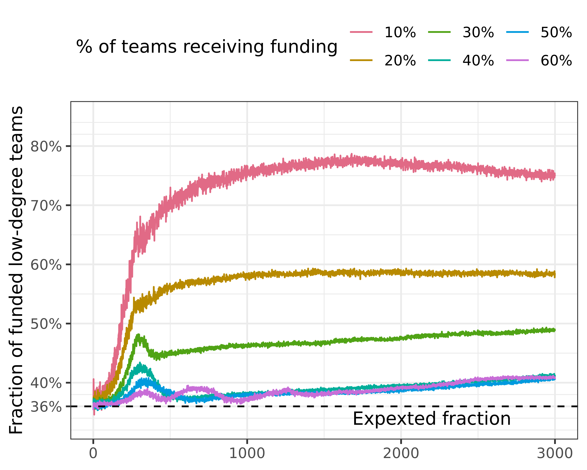
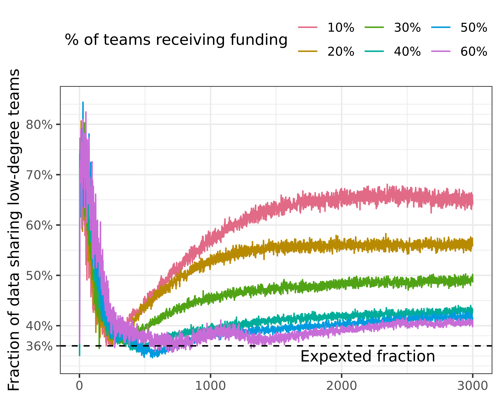

Research questions:

-   Are always the same teams receiving funding?
-   Are those that are being funded also those that share data?
-   Are those that share data / receive funding more or less central in the
    network?


::: {.cell}

:::


# Are always the same teams receiving funding?
## Fragmented (low clustering) network
Here, we only look at steps equal or above 2000 (steps 2000-3000), since we are
interested in the long-run dynamics.


::: {.cell}

```{.r .cell-code}
# we did not store whether a given team was funded, and it is quite 
# time-consuming to re-run everything. We can compute this (with quite some
# effort) by checking if their total funding increased or not.

# check funding progress
funding_status <- fragmented %>% 
  filter(sharingincentive == .4,
         # we can restrict this to steps above 2000, since we are interested in
         # the equilibrium state here
         step >= 2000)
```
:::

::: {.cell}

```{.r .cell-code}
# lagged model for funding

regression_results <- funding_status %>% 
  # it also fails currently, no idea why
  ml_logistic_regression(funded ~ initial_resources + funded_lag) 
```
:::

::: {.cell}

```{.r .cell-code}
print(regression_results)
```
:::


There seems to be a massive effect of the lagged funding status, if we take a
global look at all funding incentive settings.


::: {.cell}

```{.r .cell-code}
correlations <- funding_status %>% 
  group_by(maxinitialutility, fundedshare) %>% 
  summarise(cor_funding = cor(as.numeric(funded), as.numeric(funded_lag)),
            cor_init_resources = cor(as.numeric(funded), as.numeric(initial_resources))) %>% 
  collect()
```

::: {.cell-output .cell-output-stderr}
```
`summarise()` has grouped output by "maxinitialutility". You can override using
the `.groups` argument.
```
:::
:::

::: {.cell}

```{.r .cell-code}
correlations %>% 
  arrange(maxinitialutility, fundedshare) %>% 
  knitr::kable()
```

::: {.cell-output-display}
| maxinitialutility| fundedshare| cor_funding| cor_init_resources|
|-----------------:|-----------:|-----------:|------------------:|
|                -4|         0.1|   0.9542113|          0.0106203|
|                -4|         0.2|   0.9588905|         -0.0576242|
|                -4|         0.3|   0.9528467|         -0.1407019|
|                -4|         0.4|   0.9544672|         -0.2778403|
|                -4|         0.5|   0.9525710|         -0.3824903|
|                -4|         0.6|   0.9507971|         -0.2691963|
|                 4|         0.1|   0.9442191|          0.0844402|
|                 4|         0.2|   0.9535090|          0.1629669|
|                 4|         0.3|   0.9560221|          0.1500305|
|                 4|         0.4|   0.9551332|          0.1648794|
|                 4|         0.5|   0.9543237|          0.1068485|
|                 4|         0.6|   0.9516042|          0.0736735|
:::
:::

::: {.cell}

```{.r .cell-code}
plot_skeleton <- function(df, var) {
  df %>% 
    mutate(maxinitialutility = recode(maxinitialutility, `4` = "Uniform initial sharing effort",
                                      `-4` = "Low initial sharing effort")) %>% 
    ggplot(aes(fundedshare, {{ var }}, 
               colour = as.factor(maxinitialutility))) +
    geom_line() +
    geom_point() +
    colorspace::scale_colour_discrete_qualitative() +
    scale_x_continuous(labels = scales::label_percent()) +
    labs(colour = NULL, x = "Share of teams receiving funding") +
    theme(legend.position = "top")
}
```
:::

::: {.cell}

```{.r .cell-code}
p1 <- plot_skeleton(correlations, cor_funding) +
  labs(y = "Corr funding & lagged funding")
p1
```

::: {.cell-output-display}
{width=1500}
:::
:::


The correlation between current and previous funding status is very high - there
seems to be almost complete path dependency, once the simulation has entered the
equilibrium state.


::: {.cell}

```{.r .cell-code}
p2 <- plot_skeleton(correlations, cor_init_resources) +
  labs(y = "Corr funding & initial resources")
p2
```

::: {.cell-output-display}
{width=1500}
:::
:::


Interestingly, the correlation with initial resources is much lower. For uniform
initial utility, it is relatively low across all funding selectivity settings.

For low initial utility, this is not true, and there is actually a negative
correlation. This lends credence to our initial hypothesis: teams with initially
higher resources (presumably, to be confirmed below) share less data, and thus
are less successful under the incentive regime.


::: {.cell}

```{.r .cell-code}
p1 + p2 +
  plot_layout(guides = "collect") + 
  plot_annotation(tag_levels = "A") & theme(legend.position = "top")
```

::: {.cell-output-display}
{width=2400}
:::
:::


## No network


::: {.cell}

```{.r .cell-code}
funding_status_no_network <- no_network %>% 
  filter(sharingincentive == .4,
         # we can restrict this to steps above 2000, since we are interested in
         # the equilibrium state here
         step >= 2000)
```
:::

::: {.cell}

```{.r .cell-code}
regression_results <- funding_status_no_network %>% 
  # it also fails currently, no idea why
  ml_logistic_regression(funded ~ initial_resources + funded_lag) 
```
:::

::: {.cell}

```{.r .cell-code}
print(regression_results)
```
:::


With the baseline without a network, there is equally a strong influence of path
dependency. Initial resources have a slightly stronger role than in the case of
the fragmented network.


::: {.cell}

```{.r .cell-code}
correlations_no_network <- funding_status_no_network %>% 
  group_by(maxinitialutility, fundedshare) %>% 
  summarise(cor_funding = cor(as.numeric(funded), as.numeric(funded_lag)),
            cor_init_resources = cor(as.numeric(funded), as.numeric(initial_resources))) %>% 
  collect()
```

::: {.cell-output .cell-output-stderr}
```
`summarise()` has grouped output by "maxinitialutility". You can override using
the `.groups` argument.
```
:::
:::

::: {.cell}

```{.r .cell-code}
correlations_no_network %>% 
  arrange(maxinitialutility, fundedshare) %>% 
  knitr::kable()
```

::: {.cell-output-display}
| maxinitialutility| fundedshare| cor_funding| cor_init_resources|
|-----------------:|-----------:|-----------:|------------------:|
|                -4|         0.1|   0.8121845|          0.0065602|
|                -4|         0.2|   0.9023002|         -0.0471462|
|                -4|         0.3|   0.9373384|         -0.1178397|
|                -4|         0.4|   0.9501977|         -0.0499509|
|                -4|         0.5|   0.9527413|         -0.0145661|
|                -4|         0.6|   0.8737687|         -0.0212698|
|                 4|         0.1|   0.9861305|          0.3249158|
|                 4|         0.2|   0.9906219|          0.3626612|
|                 4|         0.3|   0.9908658|          0.2900537|
|                 4|         0.4|   0.9783700|          0.1799073|
|                 4|         0.5|   0.9671437|          0.0382707|
|                 4|         0.6|   0.9707301|         -0.0082824|
:::
:::

::: {.cell}

```{.r .cell-code}
p1 <- plot_skeleton(correlations_no_network, cor_funding) +
  labs(y = "Corr funding & lagged funding")
p1
```

::: {.cell-output-display}
{width=1500}
:::
:::


Correlations for funding lag are similarly very high. However, behaviour is
different between max-initial-utility, comparing to the case of the fragmented
network. Here, correlations are higher for maxinitalutility = 4, but lower
otherwise.


::: {.cell}

```{.r .cell-code}
p2 <- plot_skeleton(correlations_no_network, cor_init_resources) +
  labs(y = "Corr funding & initial resources")
p2
```

::: {.cell-output-display}
{width=1500}
:::
:::


These correlations are stronger, i.e., more positive, as indicated by the
regression: without networks, initial resources play a stronger role in who gets
funded, especially if funding is very selective.

To our initial question for the difference between utility settings: path
dependency is much lower for low initial utility. There is even a slight
negative correlation between initial resources and funding: initially
lower-resourced teams are funded more than those with higher initial resources,
simply because they start sharing data. If utility is uniform, initial resources
play a stronger role - there is more path dependency.


::: {.cell}

```{.r .cell-code}
p1 + p2 +
  plot_layout(guides = "collect") + 
  plot_annotation(tag_levels = "A") & theme(legend.position = "top")
```

::: {.cell-output-display}
{width=2400}
:::
:::


# Are those that are being funded also those that share data?

## Low clustering


::: {.cell}

```{.r .cell-code}
funding_vs_sharing <- funding_status %>% 
  group_by(maxinitialutility, fundedshare) %>% 
  summarise(cor_funding_sharing = cor(as.numeric(funded), as.numeric(shared_data)),
            cor_sharing_lag = cor(as.numeric(shared_data), as.numeric(shared_data_lag))) %>% 
  collect()
```

::: {.cell-output .cell-output-stderr}
```
`summarise()` has grouped output by "maxinitialutility". You can override using
the `.groups` argument.
```
:::
:::

::: {.cell}

```{.r .cell-code}
plot_skeleton(funding_vs_sharing, cor_funding_sharing) +
  labs(y = "Corr funding & data sharing")
```

::: {.cell-output-display}
{width=1500}
:::
:::


Generally speaking, those that are being funded are also those that share data,
in this instance. The correlation is stronger for less selective regimes. What
does this indicate? Maybe the broader reach of the funding agency, if many teams
are being funded? But wouldn't it be the case that if funding is more selective,
only those that are funded also share data, because it is too costly otherwise?
But maybe it is the opposite: if funding is very selective, not many teams can
afford to share data, and thus not many do. If funding is less selective, more
teams share data, and thus, generally, those being funded are also more often
those which share data. Does this make sense?


::: {.cell}

```{.r .cell-code}
plot_skeleton(funding_vs_sharing, cor_sharing_lag) +
  labs(y = "Corr data sharing & data sharing lag")
```

::: {.cell-output-display}
{width=1500}
:::
:::


The correlation between sharing, and the shared lag (whether teams keep sharing
data) is also quite high, and the graph looks very similar to the one right
above. This implies that there is path dependency around sharing, where teams
share data and receive funding, while others do neither.

## No network


::: {.cell}

```{.r .cell-code}
funding_vs_sharing_no_network <- funding_status_no_network %>% 
  group_by(maxinitialutility, fundedshare) %>% 
  summarise(cor_funding_sharing = cor(as.numeric(funded), as.numeric(shared_data)),
            cor_sharing_lag = cor(as.numeric(shared_data), as.numeric(shared_data_lag))) %>% 
  collect()
```

::: {.cell-output .cell-output-stderr}
```
`summarise()` has grouped output by "maxinitialutility". You can override using
the `.groups` argument.
```
:::
:::

::: {.cell}

```{.r .cell-code}
plot_skeleton(funding_vs_sharing_no_network, cor_funding_sharing) +
  labs(y = "Corr funding & data sharing")
```

::: {.cell-output-display}
{width=1500}
:::
:::

::: {.cell}

```{.r .cell-code}
plot_skeleton(funding_vs_sharing_no_network, cor_sharing_lag) +
  labs(y = "Corr data sharing & data sharing lag")
```

::: {.cell-output-display}
{width=1500}
:::
:::


Again, we see that the correlation between funding and sharing seems to be
largely driven by previous sharing - the correlations between sharing and
sharing lag are essentially the same, just slightly lower.

We can thus conclude, that generally speaking, those who share data are also
those who receive funding. However, in the case of no networks, this correlation
is weaker, and especially weaker in case of low initial utility.

# Are those that share data / receive funding more or less central in the network?

HIGHLY INTERESTING OBSERVATION: in the fragmented network, it is mostly those
teams which are not well-connected that keep sharing data (in line with the
general finding that no network leads to more sharing than having a network.
Those that are closer to having no network (low degree) are thus more likely to
share). Is it then also those that receive more funding? Need to compare with
centrality measures.

This might be the reason, why the means that we show are much smoother for the
fragmented network, compared to the clustered, and especially the random
network: in the fragmented network, the types of nodes sharing data are quite
similar across runs, because there is a strong difference in degree between the
nodes. In the clustered, and more so in the random network, there are not so big
differences in degree, and thus there is more variability in who shares.


::: {.cell}

```{.r .cell-code}
# get network data
fragmented_network <- igraph::read_graph(here("network_generation/data/fragmented_network.gml"), format = "gml")

# calculate centrality
fragmented_centrality_local <- fragmented_network %>% 
  as_tbl_graph() %>% 
  mutate(degree = centrality_degree(),
         mean_degree = median(degree),
         is_low_degree = degree < mean_degree) %>% 
  select(who = id, degree, is_low_degree) %>% 
  as_tibble()

fragmented_centrality_local %>% 
  copy_to(sc, ., name = "fragmented_centrality", overwrite = TRUE)
```

::: {.cell-output .cell-output-stdout}
```
# Source: spark<fragmented_centrality> [?? x 3]
     who degree is_low_degree
   <dbl>  <dbl> <lgl>        
 1     0      3 FALSE        
 2     1      3 FALSE        
 3     2      2 TRUE         
 4     3      3 FALSE        
 5     4      2 TRUE         
 6     5      3 FALSE        
 7     6      1 TRUE         
 8     7      1 TRUE         
 9     8      3 FALSE        
10     9      1 TRUE         
# ℹ more rows
```
:::

```{.r .cell-code}
fragmented_centrality <- tbl(sc, "fragmented_centrality")

fragmented_centrality
```

::: {.cell-output .cell-output-stdout}
```
# Source: spark<fragmented_centrality> [?? x 3]
     who degree is_low_degree
   <dbl>  <dbl> <lgl>        
 1     0      3 FALSE        
 2     1      3 FALSE        
 3     2      2 TRUE         
 4     3      3 FALSE        
 5     4      2 TRUE         
 6     5      3 FALSE        
 7     6      1 TRUE         
 8     7      1 TRUE         
 9     8      3 FALSE        
10     9      1 TRUE         
# ℹ more rows
```
:::
:::

::: {.cell}

```{.r .cell-code}
degree_stats <- funding_status %>% 
  left_join(fragmented_centrality, by = "who") %>% 
  group_by(maxinitialutility, fundedshare) %>% 
  summarise(cor_degree_sharing = cor(as.numeric(degree), as.numeric(shared_data)),
            cor_degree_funding = cor(as.numeric(degree), as.numeric(funded))) %>% 
  collect()
```

::: {.cell-output .cell-output-stderr}
```
`summarise()` has grouped output by "maxinitialutility". You can override using
the `.groups` argument.
```
:::
:::

::: {.cell}

```{.r .cell-code}
degree_stats %>% 
  ggplot(aes(fundedshare, cor_degree_sharing, 
             colour = as.factor(maxinitialutility))) +
  geom_line() +
  geom_point()
```

::: {.cell-output-display}
{width=1500}
:::
:::


Correlations are negative, but not very strong. The negative correlation means
that teams with a lower degree share more. This is apparently the case. The
correlation is weak, since not all low-degree teams share data, simply because
not all teams are being funded. Once more teams are being funded, of course also
higher-degree teams are being funded, because there are only so few low-degree
teams.

How can we show this better? We can compute what the fraction of funded teams
which are low-degree is.


::: {.cell}

```{.r .cell-code}
# compute the share of teams being funded that are low-degree
low_degree_hypothesis <- funding_status %>% 
  left_join(fragmented_centrality, by = "who") %>% 
  group_by(maxinitialutility, fundedshare, run_number, step, funded) %>% 
  count(is_low_degree) %>% 
  mutate(fraction = n / sum(n)) %>% 
  filter(funded, is_low_degree) %>% 
  group_by(maxinitialutility, fundedshare) %>% 
  summarise(mean_frac_low_degree_funded = mean(fraction)) %>% 
  collect()
```

::: {.cell-output .cell-output-stderr}
```
Warning: Missing values are always removed in SQL aggregation functions.
Use `na.rm = TRUE` to silence this warning
This warning is displayed once every 8 hours.
```
:::

::: {.cell-output .cell-output-stderr}
```
`summarise()` has grouped output by "maxinitialutility". You can override using
the `.groups` argument.
```
:::
:::

::: {.cell}

```{.r .cell-code}
# what is the actual fraction of low degree teams?
true_fraction <- fragmented_centrality_local %>% 
  count(is_low_degree) %>% 
  mutate(n = n / 100) %>% 
  filter(is_low_degree) %>% 
  pull(n)

p1 <- plot_skeleton(low_degree_hypothesis, mean_frac_low_degree_funded) +
  geom_hline(yintercept = true_fraction, linetype = 2) +
  scale_y_continuous(breaks = c(true_fraction, seq(.4, to = .6, by = .05)),
                     labels = scales::label_percent()) +
  annotate("text", x = .2, y = .368, label = "Expexted fraction") +
  labs(y = "Fraction of funded low-degree teams")
p1
```

::: {.cell-output-display}
{#fig-low-degree-frac width=1500}
:::
:::


We see that for high selectivity (funded share is low), low-degree teams are
over-represented among the funded teams. The analytic approach mirrors that of a
Chisquare test.

*The same with sharing*

::: {.cell}

```{.r .cell-code}
# compute the share of teams sharing data that are low-degree
low_degree_hypothesis_sharing <- funding_status %>% 
  left_join(fragmented_centrality, by = "who") %>% 
  group_by(maxinitialutility, fundedshare, run_number, step, shared_data) %>% 
  count(is_low_degree) %>% 
  mutate(fraction = n / sum(n)) %>% 
  filter(shared_data, is_low_degree) %>% 
  group_by(maxinitialutility, fundedshare) %>% 
  summarise(mean_frac_low_degree_sharing = mean(fraction)) %>% 
  collect()
```

::: {.cell-output .cell-output-stderr}
```
`summarise()` has grouped output by "maxinitialutility". You can override using
the `.groups` argument.
```
:::
:::

::: {.cell}

```{.r .cell-code}
p2 <- plot_skeleton(low_degree_hypothesis_sharing, mean_frac_low_degree_sharing) +
  geom_hline(yintercept = true_fraction, linetype = 2) +
  scale_y_continuous(breaks = c(true_fraction, seq(.4, to = .6, by = .05)),
                     labels = scales::label_percent()) +
  annotate("text", x = .2, y = .368, label = "Expexted fraction") +
  labs(y = "Fraction of data sharing low-degree teams")
p2
```

::: {.cell-output-display}
{#fig-low-degree-frac-sharing width=1500}
:::
:::

::: {.cell}

```{.r .cell-code}
p1 + labs(y = "Funded teams") + 
  p2 + labs(y = "Sharing teams") +
  plot_layout(guides = "collect") + 
  plot_annotation(tag_levels = "A") & theme(legend.position = "top")
```

::: {.cell-output-display}
{#fig-low-degree-sharing-and-funding width=2400}
:::
:::

::: {.cell}

```{.r .cell-code}
# THE CODE BELOW DOES NOT WORK CURRENTLY
# we cannot do a grouped chisquare in spark directly, therefore using spark_apply
test_fun <- function(df) {
  res <- chisq.test(df$funded, df$is_low_degree)
  broom::tidy(res)
}

chisquare_res <- funding_status %>% 
  # head(1000) %>%
  left_join(fragmented_centrality, by = "who") %>% 
  spark_apply(test_fun, 
              columns = c("maxinitialutility", "fundedshare", "run_number", 
                          "step")) %>% 
  group_by(maxinitialutility, fundedshare) %>% 
  summarise(mean_statistic = mean(statistic),
            mean_p = mean(p.value)) %>% 
  collect()

# We could also run it like this, but it does not do grouped tests, only executes on everything
#   group_by(maxinitialutility, fundedshare, run_number, step) %>% 
#   mutate(is_low_degree = as.character(is_low_degree),
#          funded = as.character(funded)) %>% 
#   ml_chisquare_test(features = "is_low_degree", label = "funded")
```
:::

::: {.cell}

```{.r .cell-code}
spark_disconnect(sc)
```
:::
